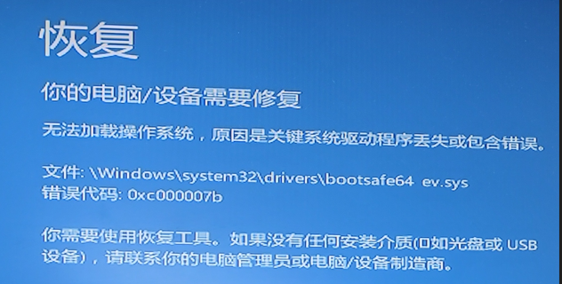

# windows 启动蓝屏  bootsafe64_ev.sys

## 0x01 分析

这个问题乍看是 windows 的引导问题，看上去是引导的某个驱动有问题似的。我也是基于这个想法在 pe下做了修复引导的操作，问题依旧。

这个时候我感觉应该不是微软的问题也不是引导的事。

随即从互联上查询了一圈之后果然不出所料，又是第三方的软件惹得祸，这次是驱动精灵也有说是驱动精灵带出来的金山毒霸的。总之都指向这几个软件引出的问题。

## 0x01 处理方法

那么我们安装互联网上面的说法处理一下。

首先进入 pe 系统，我是用的是 IT 天空的 U启通 等待进入之后，打开 diskgenius 软件。

到 windows 的所在目录，在 windows\system32\drivers\目录下找到booysafe64.sys这个文件，根据提示删除掉。

再删除 windows/system32/drivers/kavbootc64.sys （如果有的话）。

这样删除以后，从硬盘进入系统即可。

## 0x02 反思

为什么会有这样的问题？我进入到os以后确实有驱动精灵和驱动总裁这样的软件。

最主要的原因在于没有从官方的渠道去下载真正有用的驱动。总寄希望于第三方，然而第三方的工具都是要盈利的。免费给你使用必然要从其他地方赚钱回来。

这里我没有贬低第三方驱动管理软件的意思，他们在推动整个 it 产业发展方面也有着自己的贡献。我们需要做的就是从设备厂商或购买渠道那里获取第一手资料。转变这个思维才能够避免这些问题的发生。

