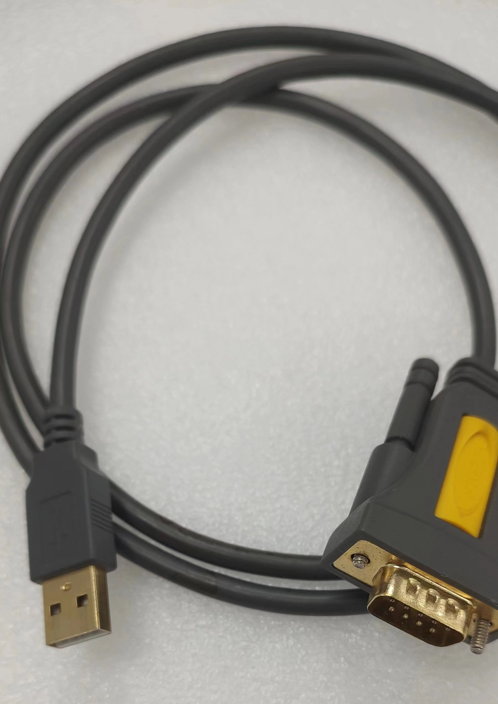
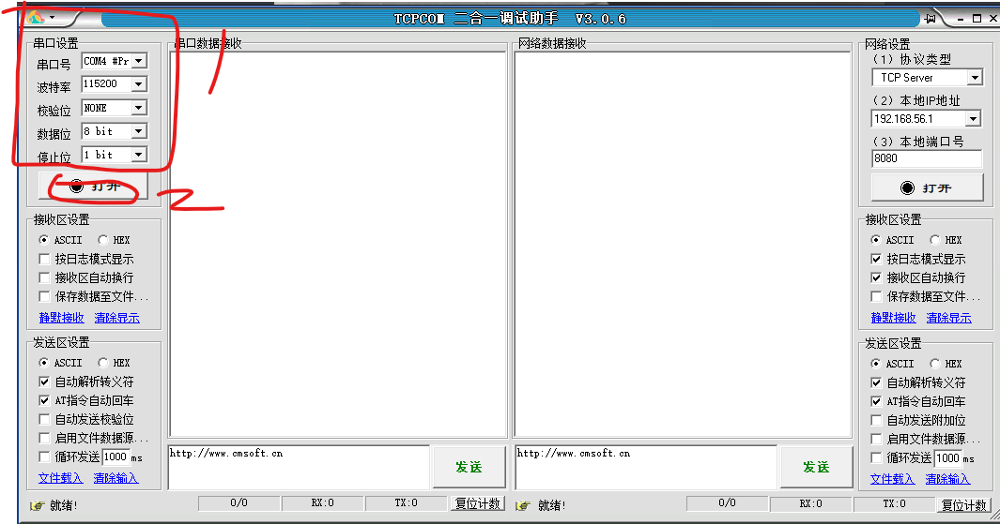
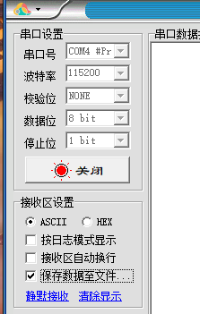

[toc]

# 串口调试使用方法

## 0x01 简介

串口调试在大部分的硬件调试中都有着非常重要的作用，这个古老的接口在今天依然发挥着不可磨灭的作用。总体来说串口的实现起来更简单，以单片机为例，即使非常低端的soc，也能够使用高低电平+定时器的方式能就够实现出TTL电平的解析，代码上甚至可以不依赖于标准库就能实现出来。

在各种各样电子设备启动的过程中，像显示这样的外设需要更多的资源去做初始化，所以各种调试基本上不依赖于屏幕。因为电路和逻辑简单，甚至在硬盘固件的调试中，也能够见到串口调试的身影。由此可见其应用的广泛性与已用性。

## 0x02 常见用法

电脑上一般使用usb转串口这样的线，推荐使用比较大品牌的产品，经过市场考研的型号。

上面这个线属于是 usb转DB9的公头，对应的主机上就只能是DB9的母头的。

上面这张图是DB9公头 DB9母头的图示

如果对端同样是公头，那么需要下面的DB9双母头连接线。

准备好上面的硬件以后，需要在操作的pc上面安装usb转232的驱动。安装好以后我们就可以在软件上操作了

这里推荐使用的是野人家园 http://www.cmsoft.cn/ 的 `TCPCOM二合一调试助手` ，是个免费软件，也可以使用其他的工具看个人喜好没有硬性要求。之所以用这个工具，我看中的是保存到文件这个功能，比较好用。

在串口设置部分，分别设置以下内容。（须根据不同项目实际参数设置）

- 串口号 选择usb转db9的驱动装出来的串口

- 波特率 115200

- 校验位 NONE

- 数据位 8 bit

- 停止位 1 bit

设置好以后点打开

勾选保存到文件，设置一下保存文件的路径及名称。

之后给需要调试的设备上电即可，数据会在右侧窗口显示，在文件中也有体现。

